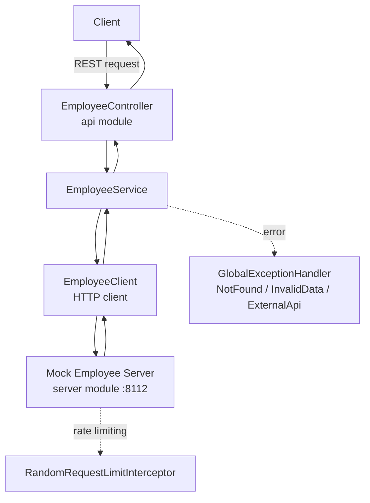

# Java-Assessment-ReliaQuest

Solution to the ReliaQuest take-home coding challenge: a Spring Boot REST API (`api` module) that implements employee-management endpoints by calling a separately-running mock employee server (`server` module).

## How it works

The `server` module is a self-contained mock backend (`MockEmployeeController`) that stores employees in memory and serves basic CRUD endpoints, deliberately rate-limited (`RandomRequestLimitInterceptor`) to simulate a flaky upstream API. The `api` module is the actual assignment: `EmployeeController` implements `IEmployeeController` and exposes the required endpoints (list all, search by name, get by ID, highest salary, top 10 earners, create, delete). Each request delegates to `EmployeeService`, which calls the mock server through `EmployeeClient` and maps responses to the `Employee` model; `GlobalExceptionHandler` translates client/upstream failures (not found, invalid input, upstream errors) into proper HTTP responses.



## Architecture

| Module | Component | Role |
|---|---|---|
| `api` | `EmployeeController` | Implements the required employee endpoints |
| `api` | `EmployeeService` | Business logic — search, salary aggregation, top-10 |
| `api` | `EmployeeClient` | HTTP client calling the mock server |
| `api` | `GlobalExceptionHandler` | Maps exceptions to HTTP error responses |
| `server` | `MockEmployeeController` | In-memory mock employee CRUD API |
| `server` | `RandomRequestLimitInterceptor` | Simulates upstream rate limiting |

## Tech stack

Java · Spring Boot · Gradle (multi-module) · JUnit

## Setup

```bash
# Terminal 1 — start the mock server
./gradlew :server:bootRun

# Terminal 2 — start the API
./gradlew :api:bootRun
```

See `api/README.md` and `server/README.md` for module-specific details.
